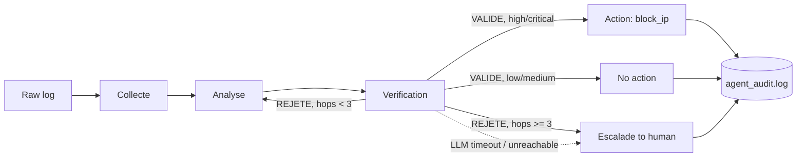

# Architecture notes

## State machine

`Collecte` is pure Python (log normalization, no LLM call). `Analyse` and
`Verification` each make one call to the local model. `Action`, `No action` and
`Escalade` are terminal nodes — the graph always resolves to exactly one of them.

## Why an escalation node instead of just stopping

The first version of this retry loop routed straight to `END` after 3 rejected
verifications. That's a real design mistake, not a stylistic choice: it means the
system silently drops a potentially critical alert — exactly the dangerous false
negative a security triage system is supposed to prevent. `node_escalade` turns that
verification failure into an explicit hand-off to a human, carrying the context needed
to act on it (raw log, last attempted analysis), instead of letting the alert disappear
without a trace.

## Engineering gotcha: state mutation inside a routing function

The retry loop (`analyse` → `verification` → back to `analyse`, routed by
`route_after_verification`) is supposed to stop after 3 rejections. Incrementing
`state["hops"]` *inside the routing function itself* — instead of inside a real node —
gets silently ignored by LangGraph: only the return value of an actual node
(`add_node`-registered `node_...` function) is persisted into the shared state. A
conditional-edge routing function used with `add_conditional_edges` is read-only by
design; state changes belong exclusively inside nodes.

Concrete symptom hit while building this: the hop counter stayed stuck at 0 and the
loop ran 7 rounds instead of stopping at 3. Moving the increment into
`node_verification` (a real node) fixed it immediately.

## Why a local model and why LangGraph

- **Local model (Ollama + `hermes3:8b`) instead of a hosted API**: the confidentiality
  argument is the actual point — logs and internal IPs never leave the local
  infrastructure. This is the core constraint the whole project is built around, not an
  afterthought.
- **LangGraph instead of a higher-level agent framework**: explicit state machine, fine
  control over the flow between agents, and — critically for a security context — full
  auditability of every transition (see `agent_audit.log`).
